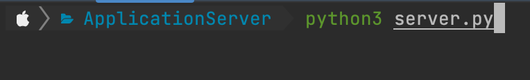
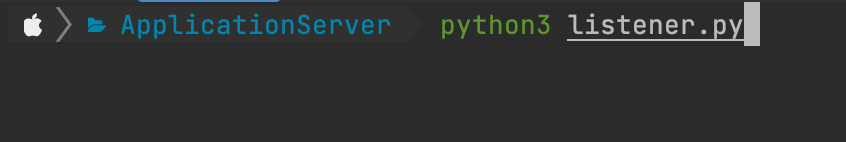
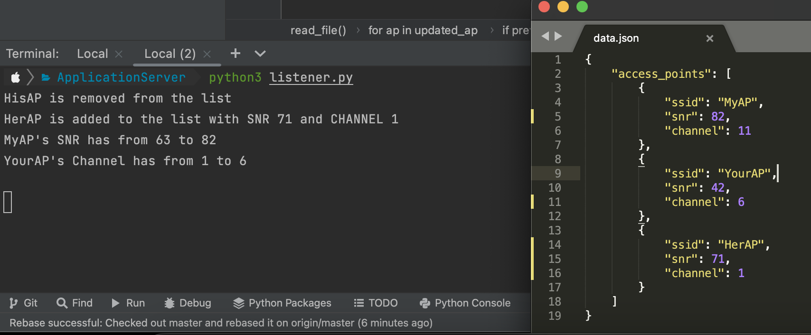

# AutomationEight - CodeTest

This application was created as a part of a coding test of AutomationEight.
The repository consists of two Python applications communicating with 
each other where **server.py** monitors the changes to a file which 
contains surrounding Wireless APs in JSON format and informs 
**listener.py**, which is responsible for displaying the changes.

### Pre setup of application
Below changes to be applied on the application code file before executing
the application.

##### server.py
line 5  : `filepath = 'YOUR_FILE_LOCATION'`    
line 13 : `host = 'HostIP | socket.gethostname() if localhost'`    
line 14 : `port = YOUR_PORT_NUMBER'`

##### listener.py
line 7 : `host = 'HOST_IP_OF server.py running'`    
line 8 : `port = PORT_NUMBER_OF server.py running'`

### Execution of application
Execute the server.py initially by:  
`python3 server.py `  

follow up by executing the listener.py:  
`python3 listener.py`

